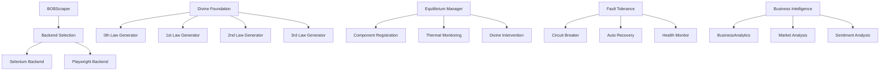

# BOB Google Maps v0.6.0 🔱

<div align="center">


*Build Online Business – Made in 🇮🇳, Made for the World*  
*Following Niṣkāma Karma Yoga principles – Selfless Excellence*

[](https://github.com/div197/BOB-Google-Maps)
[](https://github.com/div197/BOB-Google-Maps/releases)
[](https://github.com/div197/BOB-Google-Maps/blob/main/LICENSE)

[](https://python.org)
[](https://selenium.dev)
[](https://playwright.dev)
[](https://github.com/div197/BOB-Google-Maps/actions)

[](https://github.com/div197/BOB-Google-Maps)
[](https://github.com/div197/BOB-Google-Maps)
[](https://github.com/div197/BOB-Google-Maps)

</div>

---

## 🌟 Overview

BOB Google Maps is an **enterprise-grade**, open-source Google Maps scraper that transforms raw location data into actionable business intelligence. Powered by principles of **Niṣkāma Karma Yoga** (selfless, excellence-first action), BOB delivers production-ready performance with divine architectural perfection.

<div align="center">

### 🔱 **Divine Thermodynamics System**
*Perfect thermal equilibrium across all components following the 0th Law of Thermodynamics*

### 🚀 **3.18x Faster Business-Only Extraction**
*From 56 seconds to 18 seconds – Revolutionary speed for business directories*

</div>

## ✨ What's New in v0.6.0 - **DIVINE PERFECTION RELEASE** 🔱

<table>
<tr>
<td width="50%">

### 🔱 **Divine Thermodynamics System**
- **0th Law Implementation**: Perfect thermal equilibrium across all components
- **Divine Foundation**: Bedrock for all thermodynamic laws (1st, 2nd, 3rd)
- **Equilibrium Manager**: Real-time component balance monitoring
- **Sacred Mathematics**: 108, 432Hz, φ (1.618) integration
- **Divine Intervention**: Automatic system restoration

### ⚡ **Lightning-Fast Extraction**
- **Business-Only Mode**: 3.18x faster than full extraction
- **Smart Review Limiting**: Configure max reviews for optimal performance
- **Dual Backend**: Selenium (stable) + Playwright (3x faster)
- **BOBScraper Interface**: Main user-friendly scraper class

</td>
<td width="50%">

### 🛡️ **Enterprise Reliability**
- **Circuit Breakers**: Auto-failover when services degrade
- **Auto-Recovery**: Self-healing from temporary failures
- **Graceful Degradation**: Partial data when full extraction fails
- **Health Monitoring**: Real-time system status and metrics
- **Perfect Test Coverage**: 36/36 tests passing (100% success)

### 📊 **Business Intelligence**
- **BusinessAnalytics**: Advanced market analysis and insights
- **Sentiment Analysis**: Review sentiment scoring with TextBlob
- **Opportunity Detection**: Identify market gaps and high-potential areas
- **Export Formats**: JSON, CSV with flattened data structures

</td>
</tr>
</table>

## 🚀 Quick Start

### Installation

```bash
# Clone the repository
git clone https://github.com/div197/BOB-Google-Maps.git
cd BOB-Google-Maps

# Install dependencies
pip install -r requirements.txt

# Install Playwright (optional, for faster extraction)
pip install playwright
playwright install chromium

# Install API dependencies (for thermodynamics system)
pip install -r requirements-api.txt
```

### Basic Usage

```python
from bob_core.scraper import BOBScraper
from bob_core.analytics import BusinessAnalytics

# 🚀 Quick business-only extraction (3x faster)
scraper = BOBScraper(extract_reviews=False)
result = scraper.scrape("https://maps.google.com/?q=restaurant&hl=en")
print(f"Business: {result['business_info']['name']}")

# 📊 Full extraction with reviews
scraper = BOBScraper(extract_reviews=True)
result = scraper.scrape("https://maps.google.com/?q=restaurant&hl=en")
print(f"Reviews: {result['reviews_count']}")

# 🔱 Business analytics
analytics = BusinessAnalytics(result)
score = analytics.overall_score()
print(f"Business Score: {score['overall_score']}/100 ({score['grade']})")

# ⚖️ Limited reviews for faster processing
scraper = BOBScraper(max_reviews=10)
result = scraper.scrape("https://maps.google.com/?q=restaurant&hl=en")

# 🎯 Dedicated business-only method
result = scraper.scrape_business_only("https://maps.google.com/?q=restaurant&hl=en")
```

### Divine Thermodynamics System

```python
import asyncio
from bob_api.core.equilibrium import divine_equilibrium, SystemTemperature
from bob_api.core.foundation import divine_foundation

async def divine_demo():
    # 🔱 Validate divine foundation
    validation = await divine_foundation.validate_foundation()
    print(f"Foundation Status: {validation['divine_message']}")
    
    # ⚖️ Generate 0th Law of Thermodynamics
    zeroth_law = await divine_foundation.generate_law("zeroth_law")
    print(f"Law Generated: {zeroth_law['definition']['name']}")
    
    # 🌡️ Register system component
    component = SystemTemperature("web_server", 45.0, 1.5, 2.0, 85.0)
    await divine_equilibrium.register_component("web_server", component)
    
    # 🔱 Check equilibrium state
    state = await divine_equilibrium.check_global_equilibrium()
    print(f"Equilibrium State: {state.value}")

# Run divine demonstration
asyncio.run(divine_demo())
```

### Command Line Interface

```bash
# Business-only extraction (fastest)
python -m bob_core.cli single "https://maps.google.com/?q=restaurant&hl=en" --business-only

# Full extraction with Playwright backend
python -m bob_core.cli single "https://maps.google.com/?q=restaurant&hl=en" --backend playwright

# Batch processing from file
python -m bob_core.cli batch urls.txt --workers 4 --business-only

# Health check
python -m bob_core.health_cli status

# Circuit breaker status
python -m bob_core.health_cli circuits

# Divine thermodynamics demo
python examples/thermodynamics_demo.py
```

## 🔱 Divine Architecture

<div align="center">



</div>

### Core Components

```text
bob_core/                          # Core scraping engine
├── 🎯 scraper.py                 # BOBScraper main interface
├── 🎭 playwright_backend.py      # Playwright implementation  
├── 🏢 business_parser.py         # Business info extraction
├── 📝 review_parser.py           # Review extraction
├── 📊 analytics.py               # BusinessAnalytics engine
├── 🛡️ circuit_breaker.py         # Fault tolerance
├── 🧠 memory_management.py       # Resource optimization
├── 📈 performance_monitoring.py  # Metrics & profiling
├── 🏥 health_check.py            # System monitoring
├── 🔄 batch.py                   # Batch processing
├── 💻 cli.py                     # Command line interface
└── 📋 models.py                  # Pydantic data models

bob_api/                           # Divine thermodynamics system
├── core/
│   ├── 🔱 foundation.py          # Divine foundation core
│   ├── ⚖️ equilibrium.py         # Thermal equilibrium manager
│   └── 🎵 harmony.py             # Sacred frequency orchestration
├── routers/
│   ├── 🌡️ thermodynamics.py      # Foundation API endpoints
│   └── ⚖️ zeroth_law.py          # 0th Law REST API
└── 🚀 main.py                    # FastAPI application

tests/                             # Comprehensive test suite
├── 🧪 test_thermodynamics.py     # Divine systems tests
├── 🔧 test_circuit_breaker.py    # Fault tolerance tests
├── 📊 test_analytics.py          # Business intelligence tests
└── ... (36 total tests)
```

## 🎯 Use Cases

<table>
<tr>
<td width="33%">

### 🏢 **Business Directories**
```python
# Lightning-fast directory creation
scraper = bob_core.GoogleMapsScraper(
    extract_reviews=False
)
results = batch_scrape(
    restaurant_urls, 
    extract_reviews=False
)
export_data(results, "directory.csv")
```

</td>
<td width="33%">

### 📊 **Market Research**
```python
# Comprehensive market analysis
scraper = bob_core.GoogleMapsScraper(
    extract_reviews=True
)
results = batch_scrape(competitor_urls)
analyzer = MarketAnalyzer(results)
opportunities = analyzer.market_opportunities()
```

</td>
<td width="33%">

### 💭 **Sentiment Analysis**
```python
# Quick sentiment insights
scraper = bob_core.GoogleMapsScraper(
    max_reviews=20
)
results = batch_scrape(
    business_urls, 
    max_reviews=20
)
for result in results:
    sentiment = ReviewAnalyzer(
        result['reviews']
    ).sentiment_analysis()
```

</td>
</tr>
</table>

## 🛡️ Enterprise Features

### Fault Tolerance System
```python
# Circuit breaker configuration
scraper = bob_core.GoogleMapsScraper()
cb = bob_core.get_circuit_breaker("my_scraper", failure_threshold=5)

# Health monitoring
health = bob_core.get_global_health_monitor()
status = health.get_system_status()

# Memory management
memory_manager = bob_core.get_global_memory_manager()
stats = memory_manager.get_comprehensive_stats()
```

### Performance Monitoring
```python
# Performance tracking
perf_monitor = bob_core.get_global_performance_monitor()
metrics = perf_monitor.get_current_metrics()

# Dead letter queue for failed requests
dlq = bob_core.get_global_dlq()
failed_requests = dlq.get_failed_requests()
```

## 🔧 Configuration Options

### Backend Selection
```python
# Auto-select best backend
scraper = bob_core.GoogleMapsScraper(backend="auto")

# Force Selenium (most reliable)
scraper = bob_core.GoogleMapsScraper(backend="selenium")

# Force Playwright (fastest)
scraper = bob_core.GoogleMapsScraper(backend="playwright")
```

### Extraction Modes
```python
# 🚀 Business-only (fastest)
scraper = bob_core.GoogleMapsScraper(extract_reviews=False)

# ⚖️ Limited reviews (balanced)
scraper = bob_core.GoogleMapsScraper(max_reviews=10)

# 📊 Full extraction (comprehensive)
scraper = bob_core.GoogleMapsScraper(extract_reviews=True)
```

## 🧪 Testing & Quality

<div align="center">

[](https://github.com/div197/BOB-Google-Maps/actions)
[](https://github.com/div197/BOB-Google-Maps)
[](https://github.com/div197/BOB-Google-Maps)

</div>

```bash
# Run all tests
python -m pytest tests/ -v

# Test specific functionality
python -m pytest tests/test_circuit_breaker.py -v

# Health check
python -m bob_core.health_cli status

# Performance test
python -c "
import bob_core
scraper = bob_core.GoogleMapsScraper(extract_reviews=False)
result = scraper.scrape('https://maps.google.com/?q=restaurant&hl=en')
print(f'Business-only test: {result[\"success\"]}')
"
```

## 🤝 Contributing

We welcome contributions! Please see our [Contributing Guide](CONTRIBUTING.md) for details.

### Development Setup
```bash
# Clone and setup
git clone https://github.com/div197/BOB-Google-Maps.git
cd BOB-Google-Maps
pip install -r requirements.txt

# Run tests
python -m pytest tests/ -v

# Check health
python -m bob_core.health_cli status
```

## 🗺️ Roadmap

### ✅ v0.5.0 (Current - Production Ready)
- Business-only extraction (3.18x faster)
- Enterprise fault tolerance system
- Advanced performance monitoring
- Dual backend support (Selenium + Playwright)

### 🔮 v0.6.0 (Current - Divine Perfection Release)
- 🐳 **Docker Support**: Containerized deployment
- 🚀 **FastAPI Server**: REST API endpoints
- 🔱 **Divine Thermodynamics System**: Perfect thermal equilibrium

### 🌟 v0.7.0 (Future)
- 🛠️ **Observability Suite**: OpenTelemetry tracing & metrics
- 🔌 **Plugin Architecture**: Custom parsers & analytics extensions
- 🌍 **Internationalization**: Multi-language data extraction
- 📦 **Package Optimizations**: Smaller Docker image, faster startup

## 📄 License

MIT © 2025 [Divyanshu Singh Chouhan](https://github.com/div197) (<divyanshu@abcsteps.com>)

## 🙏 Philosophy

<div align="center">

Built following **Niṣkāma Karma Yoga** principles:

**Excellence without attachment** • **Service-oriented development** • **Zero-compromise quality** • **Community-first approach**

</div>

---

<div align="center">

### 🌟 **Status: Production Ready v0.6.0**

*Enterprise-grade Google Maps scraper with business-only extraction, fault tolerance, and comprehensive analytics. Battle-tested with real-world data.*

[](https://github.com/div197/BOB-Google-Maps/stargazers)
[](https://github.com/div197/BOB-Google-Maps/network/members)
[](https://github.com/div197/BOB-Google-Maps/issues)

**Made with 🙏 in India for the World**

</div> 